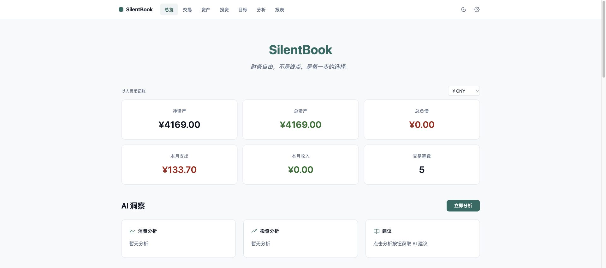
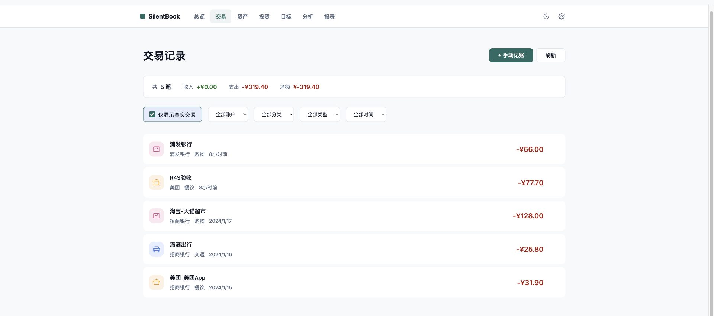

# SilentBook

> 财务自由，不是终点，是每一步的选择。

[](LICENSE)
[](https://www.python.org)
[](https://fastapi.tiangolo.com)
[](https://vuejs.org)
[](https://www.docker.com)

**个人财务中枢：手机通知自动记账 + 投资收益管理 + AI 协同分析。**

银行和支付通知自动解析入账，无需手动分类；持仓自动刷价，预算五级预警，
报表与净资产曲线一目了然；数据完全属于你，本地部署，不出门。





> 截图为测试数据，非真实账单。

---

## ✨ 特性

- 🤖 **无感记账** — 银行/支付通知自动解析入账，覆盖招行/工行/建行/农行/中行/交行/浦发/光大/中信/云闪付/支付宝/微信/美团/京东/淘宝 15 家
- 🛡️ **记账不重不漏** — Webhook HMAC 签名 + 传输/业务两级幂等，并发重试也不重记；账户余额与流水严格守恒
- 📈 **投资管理** — 持仓 CRUD，股票/基金/黄金自动刷价（天天基金/新浪），收益与回撤一目了然
- 🧠 **AI 分析** — 本地 LLM / OpenClaw 三 Agent / 自动回退；无 Key 时只提示不写垃圾数据
- 🎨 **日间纸墨** — 浅色第一、深色同源，双主题可切换；真实图表（ECharts），图标统一 Phosphor
- 💱 **汇率展示** — Frankfurter 主源 + 新浪备源，首页一键切换币种折算（账本仍记原币）
- 🐳 **一键部署** — Docker Compose 一条命令拉起全部服务；SQLite 轻量与 PG 完整双模式
- 📲 **PWA** — 可安装、离线壳、Service Worker 缓存
- 🔐 **数据自主可控** — JWT（HttpOnly Cookie）+ 多租户隔离 + Redis 限流 + 加密备份 + Alembic 迁移链

---

## 🔗 工作原理：通知是怎么来的？

SilentBook 的"自动记账"依赖一条完整的通知链路：

```
📱 手机银行/支付宝消费通知
    ↓
🔌 采集：phone-notifications 插件 / C.one 卡（二选一）
    ↓
🤖 OpenClaw 定时任务（过滤 + HMAC 签名，增量推送）
    ↓
📥 SilentBook Webhook API（/webhook/notify，单条/批量）
    ↓
🔍 Notification Parser（平台识别/方向判定/金额/商户/分类）
    ↓
💰 交易记录自动入库 + 余额联动 + 异常事件驱动分析
```

给 OpenClaw 看的完整接入文档（含签名算法示例代码、幂等语义、
source 标识表、三 Agent 模式）：[docs/openclaw-integration.md](docs/openclaw-integration.md)。

> 💡 **如果你不需要自动记账**，可以跳过采集和 OpenClaw，直接手动录入、
> 粘贴通知解析，或用 CSV / PDF 流水导入。

---

## 🏗️ 架构

```
┌─────────────────────────────────────────────────────────┐
│                      SilentBook                          │
│                                                         │
│  ┌──────────┐  ┌──────────┐  ┌──────────┐  ┌─────────┐ │
│  │ Frontend │  │ Backend  │  │  Agent   │  │ Parser  │ │
│  │ Nuxt 3   │→ │ FastAPI  │→ │ Engine   │  │ Service │ │
│  │ Vue 3    │  │routers/16│  │ (AI分析) │  │(通知解析)│ │
│  └──────────┘  └────┬─────┘  └──────────┘  └─────────┘ │
│                     │                                    │
│              ┌──────┴──────┐                             │
│              │             │                             │
│         ┌────▼────┐   ┌────▼────┐                       │
│         │PostgreSQL│   │  Redis  │                       │
│         │  数据存储 │   │ 限流缓存 │                       │
│         └─────────┘   └─────────┘                       │
└─────────────────────────────────────────────────────────┘
```

| 服务 | 技术 | 端口 | 职责 |
|------|------|------|------|
| Frontend | Nuxt 3 / Vue 3 / ECharts / Phosphor | 3000（`FRONTEND_PORT` 可改） | Web 界面，双主题，PWA |
| Backend | FastAPI / SQLAlchemy（16 个 router） | 8000（仅本机） | 核心 API，认证，CRUD，定时任务 |
| Agent | Python / LLM | 5000 | AI 分析引擎，本地 LLM 或 OpenClaw |
| Parser | Python | 6000 | 通知解析，15 家平台自动识别 |
| Database | PostgreSQL 15 | 5432 | 持久化存储（Alembic 迁移链） |
| Cache | Redis 7 | 6379 | API 限流，会话缓存 |

浏览器只访问前端 `:3000`，`/api/*` 由 Nuxt 同源代理转发到后端，无跨域问题。

---

## 🚀 快速开始

### 前置要求

- [Docker](https://docs.docker.com/get-docker/) 和 Docker Compose
- 一个 LLM API Key（可选，用于 AI 分析；阿里云百炼 / OpenAI 兼容接口均可）

### 方式一：一键安装（推荐）

**Linux / macOS：**
```bash
git clone https://github.com/minghaoran0910-cyber/silentbook.git && cd silentbook
bash install.sh
```

**Windows（PowerShell）：**
```powershell
git clone https://github.com/minghaoran0910-cyber/silentbook.git; cd silentbook
.\install.ps1
```

脚本会自动检测 Docker、生成安全密钥、创建 `.env`、拉起全部服务。

启动后访问：

| 服务 | 地址 |
|------|------|
| 🌐 前端界面 | http://localhost:3000 |
| 🔧 后端 API | http://localhost:8000（仅本机） |

> 首次启动需要构建镜像，约 2-5 分钟。后续启动秒级。
> `3000` 被占用（如 AdGuard）时，在 `.env` 里加 `FRONTEND_PORT=3100` 即可换端口。

### 方式二：手动启动

```bash
# 1. 克隆项目
git clone https://github.com/minghaoran0910-cyber/silentbook.git
cd silentbook

# 2. 配置环境变量
cp .env.example .env
# 编辑 .env，至少填入 DASHSCOPE_API_KEY（或你的 LLM Key）
# 生产环境务必修改 JWT_SECRET 和 BACKUP_ENCRYPTION_KEY

# 3. 一键启动
docker compose up -d
```

### 纯内网 http 部署注意

如果像软路由这样直接用 `http://IP:端口` 访问（无 HTTPS），需要在 `.env` 里加：

```
COOKIE_SECURE=false
```

否则浏览器会拒收带 `Secure` 标记的登录 Cookie，导致永远登录不上。
HTTPS 部署保持默认 `true`。

### 配置 AI 分析（可选但推荐）

1. 前往 [阿里云百炼](https://dashscope.aliyun.com) 注册并获取 API Key
2. 编辑 `.env`，填入 `DASHSCOPE_API_KEY=***`
3. 重启服务：`docker compose restart agent`

> 💡 如果你使用 OpenClaw 的 Agent 模式，还需要配置 `OPENCLAW_GATEWAY_URL`
> 指向你的网关，并在前端设置页绑定你自己的 Agent（支持自动发现和手动绑定）。
> 详见 [OpenClaw 接入文档](docs/openclaw-integration.md)。
>
> ⚠️ 不配置 API Key 也能用——记账、资产管理等核心功能不受影响，只是 AI 分析会显示"未配置"（且不会写入垃圾数据）。

---

## 🎯 部署模式

### 0. 轻量模式（最简单 · SQLite 单文件）⭐

个人本地使用的最简方式——**无需 PostgreSQL、无需 Redis**，数据存本地单个 SQLite 文件，一条命令启动：

```bash
docker compose -f docker-compose.lite.yml up -d
```

适合单人记账、想快速上手、不想维护数据库的用户。多用户或对外部署请用下面的完整模式。

### 1. 本地模式（默认，PostgreSQL 完整版）

```bash
docker compose up -d
```

所有服务运行在本地。适合个人使用、注重隐私、不想数据出门。

### 2. 混合模式

- **服务器**：前端 + 后端（随时可访问）
- **本地**：数据库 + Agent（数据不出门）

```bash
# 服务器端
docker compose -f docker-compose.server.yml up -d

# 本地端
docker compose -f docker-compose.local.yml up -d
```

### 3. 云端模式

所有服务部署在云端 VPS。适合多设备访问、团队共享。

> ⚠️ 云端部署务必配置 HTTPS、强密钥、防火墙规则。

---

## 🔐 安全

SilentBook 处理的是你的财务数据，安全是底线：

- **JWT 认证** — HttpOnly Cookie 下发（`Secure` 可配，适配 http 内网），防 XSS 窃取
- **多租户隔离** — 数据库层面的行级隔离，用户之间数据完全不可见
- **API 限流** — Redis 滑动窗口限流，防暴力破解和滥用
- **加密备份** — 数据库备份使用 Fernet 对称加密，密钥不入库
- **Webhook 签名** — 通知推送接口使用 HMAC-SHA256 签名 + 时间窗 + 传输/业务两级幂等
- **生产加固** — 生产环境自动启用安全响应头（CSP / HSTS / X-Frame-Options）

> 生产环境必须设置：`JWT_SECRET`（随机 ≥32 字符）、`WEBHOOK_SECRET`、`BACKUP_ENCRYPTION_KEY`。
> 生成方式：`openssl rand -hex 32`

---

## 📂 项目结构

```
silentbook/
├── frontend/                    # Nuxt 3 / Vue 3 前端
│   ├── pages/                   #   页面（总览/交易/资产/投资/目标/分析/报表/记账/设置）
│   ├── components/              #   NavBar / AppIcon（Phosphor 统一图标）
│   ├── composables/             #   useAuth / useTheme / useECharts
│   ├── server/api/              #   /api 同源代理（手写转发，无外部 nginx）
│   ├── utils/                   #   api.ts（统一鉴权出口）/ icons.ts（分类映射）
│   └── public/                  #   PWA manifest + 图标 + sw
├── backend/                     # FastAPI 后端
│   └── app/
│       ├── main.py              #   启动/中间件/路由挂载（229 行）
│       ├── routers/             #   16 个领域 router + 共享 deps
│       │   ├── transactions.py  #     交易 + 余额守恒
│       │   ├── ingest.py        #     /parse + webhook + 幂等
│       │   ├── stats.py / reports.py / cashflow.py
│       │   ├── budgets.py / goals.py / recurring.py
│       │   ├── accounts.py / assets.py / investments.py
│       │   ├── analysis.py / settings.py / settings_ai.py
│       │   ├── backup.py / admin.py / fx.py / deps.py
│       ├── auth.py              #   认证（JWT / Cookie / 密码重置）
│       ├── database.py          #   数据模型 + 多租户隔离
│       ├── scheduler.py         #   定时任务（多 worker 单飞锁）
│       └── asset_sync.py        #   持仓刷价（天天基金/新浪）
├── agent/                       # AI Agent 分析引擎（本地 LLM / OpenClaw / auto）
├── notification-parser/         # 通知解析服务（15 家平台 + 方向判定 + 过滤）
├── docs/
│   ├── quickstart.md            #   详细部署指南
│   ├── deployment.md            #   部署模式说明
│   ├── notification-pipeline.md #   通知链路与签名规范
│   ├── openclaw-integration.md  #   给 OpenClaw 的接入使用文档
│   ├── acceptance-report.md     #   重构验收报告（含 bug 清单）
│   ├── contributing.md          #   贡献指南
│   └── assets/                  #   README 截图
├── docker-compose.yml           # 完整模式（PostgreSQL + Redis）
├── docker-compose.lite.yml      # 轻量模式（SQLite 单文件）
├── docker-compose.server.yml    # 混合模式（服务器端）
├── docker-compose.local.yml     # 混合模式（本地端）
├── .env.example                 # 环境变量模板
└── ROADMAP.md                   # 开发路线图
```

---

## 🛠️ 技术栈

| 层 | 技术 |
|----|------|
| 前端 | Nuxt 3, Vue 3, TypeScript, ECharts, Phosphor Icons, PWA |
| 后端 | FastAPI, SQLAlchemy 2.0, Pydantic 2, APScheduler |
| 数据库 | PostgreSQL 15（完整）/ SQLite（轻量），Alembic 迁移链 |
| 缓存 | Redis 7 |
| AI | 阿里云百炼 / OpenAI 兼容接口 / OpenClaw Agent |
| 部署 | Docker Compose |
| 认证 | JWT (PyJWT) + bcrypt，HttpOnly Cookie |
| 测试 | pytest（webhook 幂等/账本守恒/FX/迁移/PDF 回归） |

---

## 📚 文档索引

- [快速开始（详细）](docs/quickstart.md) · [部署模式](docs/deployment.md)
- [通知链路与签名规范](docs/notification-pipeline.md) · [**OpenClaw 接入使用文档**](docs/openclaw-integration.md)
- [重构验收报告](docs/acceptance-report.md) · [分发规划](docs/distribution.md) · [贡献指南](docs/contributing.md)

---

## 🤝 贡献

欢迎提交 Issue 和 Pull Request。

- 🐛 发现 Bug → [提 Issue](https://github.com/minghaoran0910-cyber/silentbook/issues)
- 💡 功能建议 → [提 Issue](https://github.com/minghaoran0910-cyber/silentbook/issues) 标记 `enhancement`
- 💬 OpenClaw 侧解析/分类问题 → 附脱敏原文提 Issue（加关键词即可支持）
- 🔧 代码贡献 → Fork → 新建分支 → 提 PR

---

## 📄 License

[MIT](LICENSE) — 自由使用、修改、分发。

---

<p align="center">

**SilentBook** — 让 AI 帮你管钱，而不是帮你花钱。

</p>
